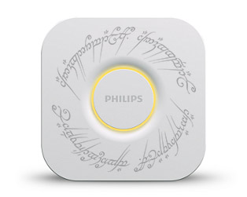

# OneBridge - _to rule them all_ 

OneBridge consists of 2 parts:

1. Server. This server runs on premise and connects to the bridges to rule.
2. Client. The client runs in the browser and can be used to configure the server and to control the lamps.

## Development
- Running locally: `docker build . -t onebrige && docker run onebridge`.
- See the datafile: `docker exec -it $(docker ps | grep onebridge | awk '{print $1}') cat onebridge.data.json`
- Deploying to Resin: `resin deploy OneBridge`

## Usage
[Open the client](https://q42.github.io/OneBridge).
